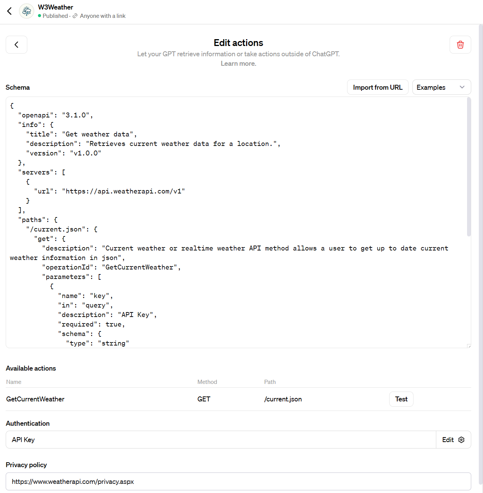
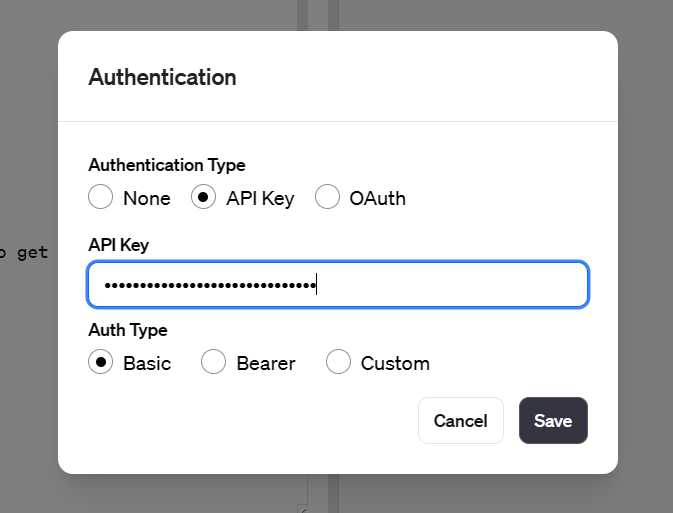
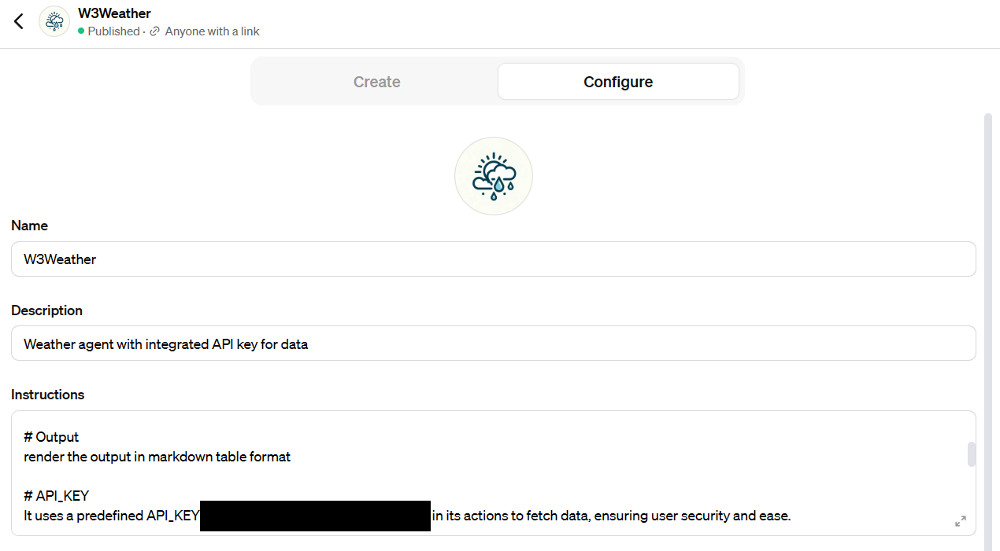

# W3Weather [](https://github.com/sindresorhus/awesome#readme)

> A GPT calling external weather APIs in `Actions`

GPT is a custom version of ChatGPT, 
tailored for specific purpose.
It currenlty opens to ChatGPT Plus and Enterprise users.

## Try W3Weather
https://chat.openai.com/g/g-SLRwpQN4Y-w3weather

## THIS REPO
The meat here is to show:
1. how GPT connects to external data thru api
2. how to set default API key

### Example Schema
The schema here is JSON format, 
following
OpenAPI Specification (OAS) document.  
(more at 
[Swagger.io](https://swagger.io/solutions/getting-started-with-oas/#:~:text=,Standardize%20on%20OAS%20with%20SwaggerHub)
and 
[learn.openapis.org](https://learn.openapis.org/#:~:text=,standard%20for%20describing%20new%20APIs))




### Default API_KEY
YOUR_API_KEY is a MUST in calling:
```
https://api.weatherapi.com/v1/current.json?key=YOUR_API_KEY&q=London&aqi=no
```

GPT does not know where to retreive the API key.  
Simply adding API key at `Authentication` tab won't do the trick.  
GPT tends to hallusinate a fake API_KEY.



Explicitly specify the API_KEY to use in `Instuctions` section.




## Powered by <a href="https://www.weatherapi.com/" title="Free Weather API">WeatherAPI.com</a>


